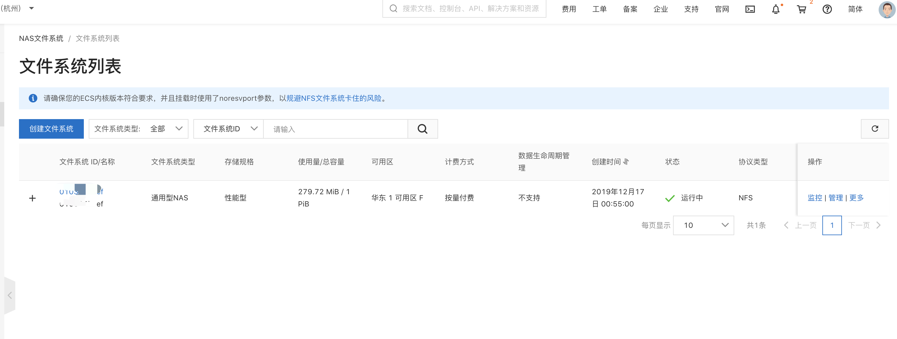
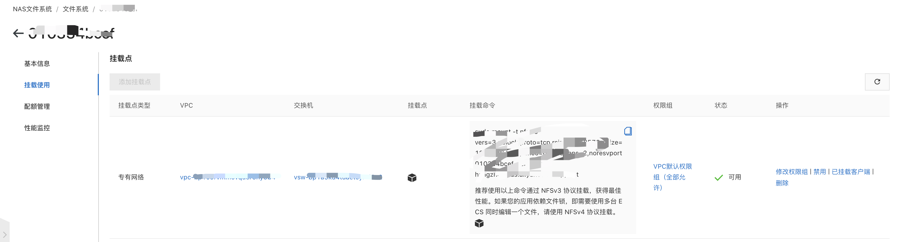

## 阿里云NAS实践

## 1.前言
NAS存储盘能将nfs（网络文件系统）挂载到你的Pod中，阿里云Kubernetes CSI支持静态存储卷挂载和动态存储卷挂载2种方式， 在静态存储卷挂载的方式中，
通常需要手动编辑和创建一个pv/pvc进行挂载，当需要的pv/pvc数量很大的时候，手动创建就显得非常繁琐了，这时动态存储卷挂载的功能可以满足您的需求。本文演示如何使用NAS动态存储卷


## 2.部署cis-nas-plugin
如何你的Kubernetes集群中还没有部署， 请参考以下步骤进行部署：

### 2.1 部署csi-provisioner
```shell script
kubectl create -f https://raw.githubusercontent.com/xishengcai/alibaba-cloud-csi-driver/master/deploy/nas/nas-provisioner.yaml
```

### 2.2 部署csi-nasplugin
```shell script
kubectl create -f https://raw.githubusercontent.com/xishengcai/alibaba-cloud-csi-driver/master/deploy/nas/nas-plugin.yaml
```

## 3. 使用NAS动态存储卷
目前阿里云Kubernetes CSI支持2种类型的NAS动态存储卷挂载：subpath方式和filesystem方式。

当你的多个Kubernetes应用或者Pod需要挂载相同的NAS存储卷共享数据时，或不同的Pod挂载相同NAS文件系统的不同子目录时， 
可以使用subpath类型的NAS动态存储卷方式。

### 3.1 创建NAS文件系统和挂载点
subpath 的方式要求用户首先使用NAS控制台 或 SDK/API 创建好NAS文件系统和挂载点。

文件系统：


挂载点:


### 3.3 创建StoragClass
编辑storageclass.yaml文件, 详细参数说明见：https://github.com/kubernetes-sigs/alibaba-cloud-csi-driver/blob/master/docs/nas-dynamic.md
```yaml
apiVersion: storage.k8s.io/v1
kind: StorageClass
metadata:
  name: alicloud-nas-subpath
mountOptions:
- nolock,tcp,noresvport
- vers=3
parameters:
  volumeAs: subpath
  server: "xxxxxxx.cn-hangzhou.nas.aliyuncs.com:/k8s/"
provisioner: nasplugin.csi.alibabacloud.com
reclaimPolicy: Retain
```
运行以下命令创建StorageClass alicloud-nas-subpath

```shell script
kubectl create -f storageclass.yaml
```

### 3.4 创建PV/PVC和Pod挂载NAS存储卷
创建Pod nginx-1 nginx-2共享NAS存储卷的同一个子目录， pvc.yaml nginx-1.yaml和nginx-2.yaml文件内容如下：

```shell script
kubectl create -f https://raw.githubusercontent.com/xishengcai/alibaba-cloud-csi-driver/master/examples/nas/my-example/pvc.yaml
kubectl create -f https://raw.githubusercontent.com/xishengcai/alibaba-cloud-csi-driver/master/examples/nas/my-example/nginx-1.yaml
kubectl create -f  https://raw.githubusercontent.com/xishengcai/alibaba-cloud-csi-driver/master/examples/nas/my-example/nginx-2.yaml
```

在这种情况下， NAS存储卷的xxxxxxx.cn-hangzhou.nas.aliyuncs.com:/share/nas-79438493-f3e0-11e9-bbe5-00163e09c2be 
会同时挂载到deployment-nas-1-5b5cdb85f6-nhklx 和 deployment-nas-2-c5bb4746c-4jw5l 的 /data目录下。
 注意: "/share" 为StorageClass中指定的subpath，"nas-79438493-f3e0-11e9-bbe5-00163e09c2be"为pv的name

如果你需要为不同的Pod挂载同一个NAS文件系统的不同子目录， 则需要分别创建pvc-1和nginx-1以及pvc-2和nginx-2。

## ref
- [https://zhuanlan.zhihu.com/p/87871885](https://zhuanlan.zhihu.com/p/87871885)
- [dynamic](https://github.com/kubernetes-sigs/alibaba-cloud-csi-driver/tree/master/examples/nas/dynamic?spm=a2c4e.10696291.0.0.496319a49Fi1LI)
